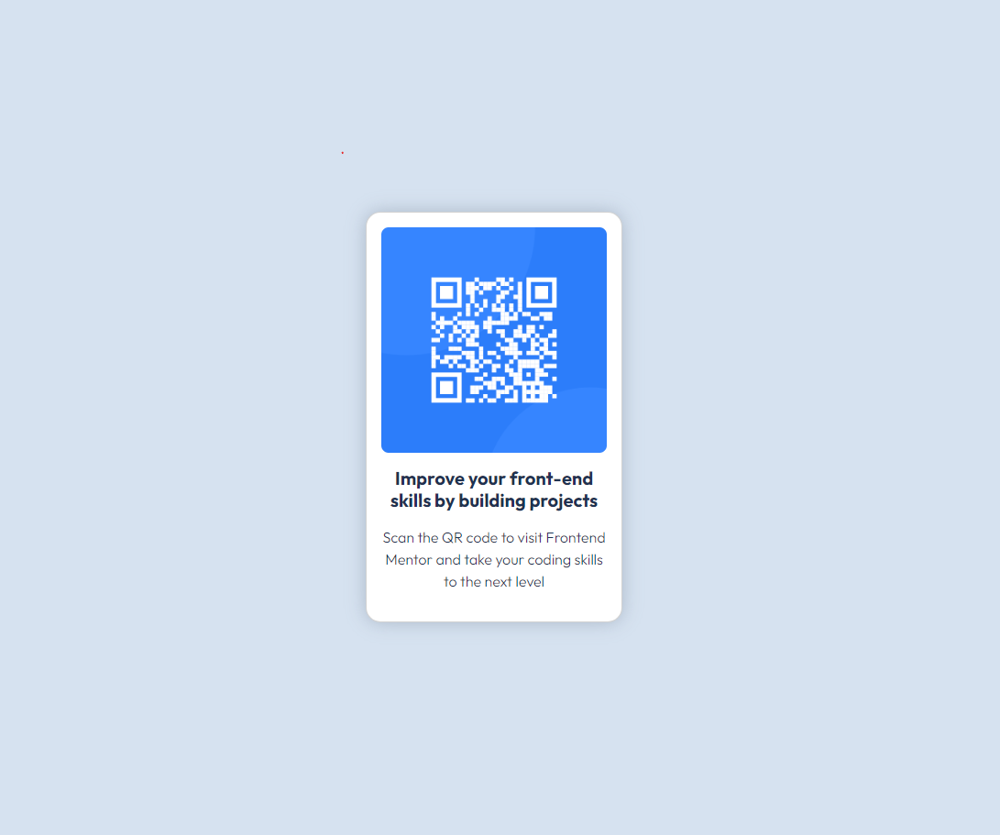

# Frontend Mentor - QR code component solution

This is a solution to the [QR code component challenge on Frontend Mentor](https://www.frontendmentor.io/challenges/qr-code-component-iux_sIO_H). Frontend Mentor challenges help you improve your coding skills by building realistic projects. 

## Table of contents

- [Overview](#overview)
  - [Screenshot](#screenshot)
  - [Links](#links)
- [My process](#my-process)
  - [Built with](#built-with)
    - [Characteristics](#characteristics)
    - [Major tools (libraries, frameworks, etc.)](#major-tools)
    - [Other tools](#other-tools)
  - [What I learned](#what-i-learned)
  - [Continued development](#continued-development)
  - [Useful resources](#useful-resources)
- [Author](#author)
- [Acknowledgments](#acknowledgments)

## Overview

### Screenshot



### Links

- Solution URL: [lucarl07/qr-code-component](https://github.com/lucarl07/qr-code-component)
- Live Site URL: [QR code component](https://lucarl07.github.io/qr-code-component/)

## My process

### Built with

#### Characteristics

- Semantic HTML5 markup
- CSS custom properties
- Flexbox-oriented design

#### Major tools (libraries, frameworks, etc.) {#major-tools}

- [Vite](https://vite.dev) - Web app builder
- [React](https://reactjs.org/) - JS library
- [SCSS](https://sass-lang.com) - CSS preprocessor
- [Bootstrap](https://getbootstrap.com) - Web design toolkit

#### Other tools

- [ESLint](https://eslint.org) - JS linter
- [prop-types](https://github.com/facebook/prop-types) - Type-checking for React

### What I learned

**Context:** I started this project exactly one week ago (*during computing class, shhhh*), when noticing that I have not yet finished anything on Frontend Mentor, and with nothing else to do, I decided to take a shot at the "Getting started on Frontend Mentor" challenge. 

Having this path as one of its steps, i downloaded the project files and started building for React, using Vite. I realized I'd also like to use Bootstrap for styles, but ended up relying more on SCSS - which was great because always wanted to give Sass a try, and SCSS is basically an extension of regular CSS without Sass's indentation and newline treatment. Personally, i think the options for mixins, nesting and imports are great, but i was annoyed for depreciation warnings of features that didn't even appear on my code.

```scss
// from ./src/defaults.scss:
@mixin shadow($opacity: 1, $length: 20px) {
  box-shadow: 0 0 $length hsla(216, 15%, 48%, $opacity);
}
```

Furthermore, while not nothing large, I learned to install Bootstrap (and use it locally) via NPM. Previously in my React projects which made use of this library, I always used the cached CDN version put directly on index.html, but now i know how to correctly implementing it with the help of SCSS/Sass.

```js
// from ./src/main.jsx:
import * as bootstrap from "bootstrap";
import "./defaults.scss";
```

### Continued development

First of all, I am proud to have finished a project with the support of the SCSS preprocessor; on the other hand, I am aware that the language is compiled, but i wish i could handle its script/command line execution better, since i couldn't really hide its irrelevant warnings on the console output. I feel it is important to learn more about the application building projects, including project and resource-specific settings.

As aforementioned, I also utilized the Bootstrap library/toolkit for some code, which i had some previous experience with. It actually was the motivation of the SCSS usage here, since i wanted to modify values such as default colors and size percentages, but it was more of an headache to me than was actually worth attempting[^1].

Lastly, regarding Bootstrap, I don't feel I learned anything significant from it this time (besides its installation), and maybe i could take some time either playing with more of its functionalities to learn it better, or migrate to Tailwind since it seems a lot more flexible and modern, which i might be wrong, but, who knows before trying?

### Useful resources

- [Composition Pattern (Video in Portuguese)](https://www.example.com) - This is a very interesting software design pattern which can be overkill for a small project like this, but it allows easily scalable components with a large room for varieties. I found it quite nice, and I'll definitely attempt it on a React with TypeScript (tsx) project.
- [Deploying Vite / React App to GitHub Pages (Article)](https://dev.to/rashidshamloo/deploying-vite-react-app-to-github-pages-35hf) - Despite using React for quite some time, i seldomly bothered learning how to deploy projects to GitHub Pages. While attempting to successfully deploy, i've read many articles that used the gh-pages package to build and push it to the remote repository. However, this was the only one that mentioned having to add a base path for production.
- [How to fix Error: ENOENT: no such file or directory (Answer)](https://stackoverflow.com/a/78707430) - On the same note as the previous link, i have first struggled with succesfully running the deploy script at package.json, and with this i finally figured out it would be time to actually change something at vite.config.js (or simply change the script, but i didn't realize that ATM).

## Author

- Website - [lucarl07](https://github.com/lucarl07)
- Frontend Mentor - [@lucarl07](https://www.frontendmentor.io/profile/lucarl07)
- E-mail - [Click to contact me](mailto:07lucarl.dev@gmail.com)

## Acknowledgments

I'd like to thank my friend Daniel for introducing me to the React composition pattern, which i really enjoyed using, and showed me how can strong typing (I.E. TypeScript, which i may use soon) can make a difference on the front-end.

## Footnotes

[^1]: Like, come on, 7 imports and +10 lines of code just to change a single value?